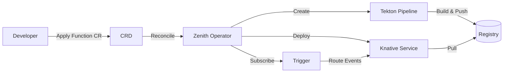

# 🚀 Zenith Operator

> **Serverless on Kubernetes, Made Simple.**

[](https://goreportcard.com/report/github.com/LucasGois1/zenith-operator)
[](https://opensource.org/licenses/Apache-2.0)
[](https://kubernetes.io)

[](https://github.com/LucasGois1/zenith-operator/actions/workflows/lint.yml)
[](https://github.com/LucasGois1/zenith-operator/actions/workflows/test.yml)
[](https://github.com/LucasGois1/zenith-operator/actions/workflows/test-e2e.yml)
[](https://codecov.io/gh/LucasGois1/zenith-operator)
[](https://github.com/LucasGois1/zenith-operator/actions/workflows/codeql.yml)
[](https://pkg.go.dev/github.com/LucasGois1/zenith-operator)

Zenith Operator abstracts the complexity of building and deploying serverless functions on Kubernetes. It orchestrates **Tekton Pipelines** for builds, **Knative Serving** for deployments, and **Knative Eventing** for event-driven invocations — all through a single `Function` Custom Resource Definition (CRD).

---

## ✨ Features

* **🛠 Automated Builds**: Integrated Cloud Native Buildpacks via Tekton. Source code to container image without a `Dockerfile`.
* **⚡ Serverless Deployment**: Auto-scaling (including scale-to-zero) powered by Knative Serving.
* **🔗 Event Driven**: Native subscription to Knative Brokers with attribute filtering.
* **🕸 Dapr Integration**: First-class support for Dapr sidecars to enable service mesh capabilities (pub/sub, state management).
* **🔒 Secure by Design**: Secret-based authentication for private Git repos and Container Registries.

---

## 🏗 Architecture

Zenith Operator serves as the glue between powerful CNCF projects:



For a deep dive into the architecture, check out the [Architecture Documentation](zenith-operator-architecture.md).

---

## 🚀 Getting Started

### Prerequisites

* Kubernetes Cluster (v1.30+)
* Helm 3.x
* `kubectl` configured to access your cluster

### Installation

#### Option 1: Helm (Recommended)

The easiest way to install Zenith Operator with all dependencies:

```sh
# Add the Helm repository
helm repo add zenith-operator https://lucasgois1.github.io/zenith-operator
helm repo update

# Install the operator and all dependencies
helm install zenith-operator zenith-operator/zenith-operator
```

This automatically installs:
- Zenith Operator
- Tekton Pipelines (for builds)
- Knative Serving (for deployments)
- Knative Eventing (for event-driven architectures)
- Kong Ingress Controller (for routing)

For detailed installation options and configuration, see the [Installation Guide](INSTALLATION.md).

#### Option 2: Manual Installation

If you prefer to install components separately:

1. **Install prerequisites:**
   - [Tekton Pipelines](https://tekton.dev/docs/pipelines/install/)
   - [Knative Serving](https://knative.dev/docs/install/serving/)
   - [Knative Eventing](https://knative.dev/docs/eventing/install/) (optional)

2. **Install the operator:**

   ```sh
   kubectl apply -f https://github.com/LucasGois1/zenith-operator/releases/latest/download/install.yaml
   ```

3. **Verify installation:**

   ```sh
   kubectl get pods -n zenith-operator-system
   ```

---

## 📖 Usage

Create a `function.yaml` file to define your function.

### 1. Basic Function (Public Repo)

```yaml
apiVersion: functions.zenith.com/v1alpha1
kind: Function
metadata:
  name: hello-world
  namespace: default
spec:
  # Source Code
  gitRepo: https://github.com/LucasGois1/zenith-test-functions
  gitRevision: main
  
  # Build Config
  build:
    image: docker.io/your-username/hello-world # Target image
    registrySecretName: registry-creds # Docker credentials
    
  # Runtime Config
  deploy:
    dapr:
      enabled: false
```

### 2. Event-Driven Function with Dapr

```yaml
apiVersion: functions.zenith.com/v1alpha1
kind: Function
metadata:
  name: payment-processor
spec:
  gitRepo: https://github.com/my-org/payment-service
  build:
    image: registry.my-company.com/payment-processor
    registrySecretName: private-registry-creds
  deploy:
    dapr:
      enabled: true
      appID: payment-service
      appPort: 8080
  eventing:
    broker: default
    filters:
      type: order.created
```

### Apply the Function

```sh
kubectl apply -f function.yaml
```

Check the status:

```sh
kubectl get function hello-world
```

---

## 🛠 Development

To run the operator locally for development:

1. **Clone the repo:**

   ```sh
   git clone https://github.com/LucasGois1/zenith-operator.git
   cd zenith-operator
   ```

2. **Install dependencies:**

   ```sh
   go mod download
   ```

3. **Run against your active cluster:**

   ```sh
   make install
   make run
   ```

---

## 📚 Documentation

Visit our [Documentation Website](https://lucasgois1.github.io/zenith-operator/) for full API references and guides.

* [Git Authentication](docs/GIT_AUTHENTICATION.md)
* [Registry Configuration](docs/REGISTRY_CONFIGURATION.md)

---

## 🤝 Contributing

Contributions are welcome! Please read our [Contributing Guidelines](CONTRIBUTING.md) before submitting a Pull Request.

## 📄 License

This project is licensed under the Apache 2.0 License - see the [LICENSE](LICENSE) file for details.
