# Zenith Operator - Comprehensive Architecture Diagram

## Overview

Zenith Operator is a Kubernetes operator that provides a serverless function platform by orchestrating builds, deployments, and event-driven invocations. It abstracts away the complexity of integrating Tekton Pipelines (for builds), Knative Serving (for deployments), and Knative Eventing (for event routing) behind a simple `Function` custom resource.

---

## 1. High-Level Architecture

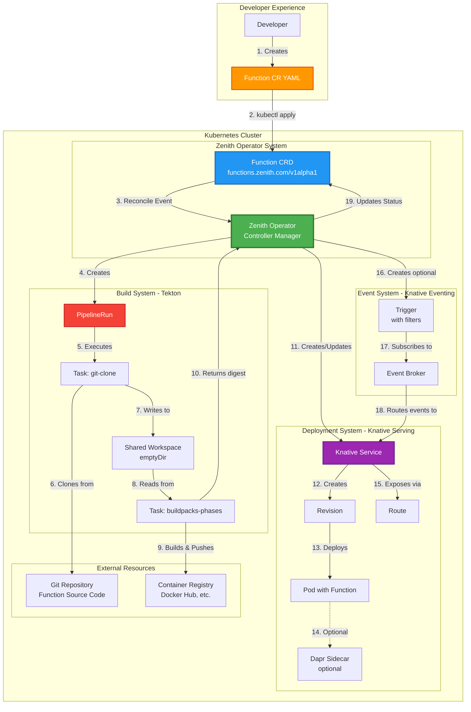

---

## 2. Function Custom Resource Structure

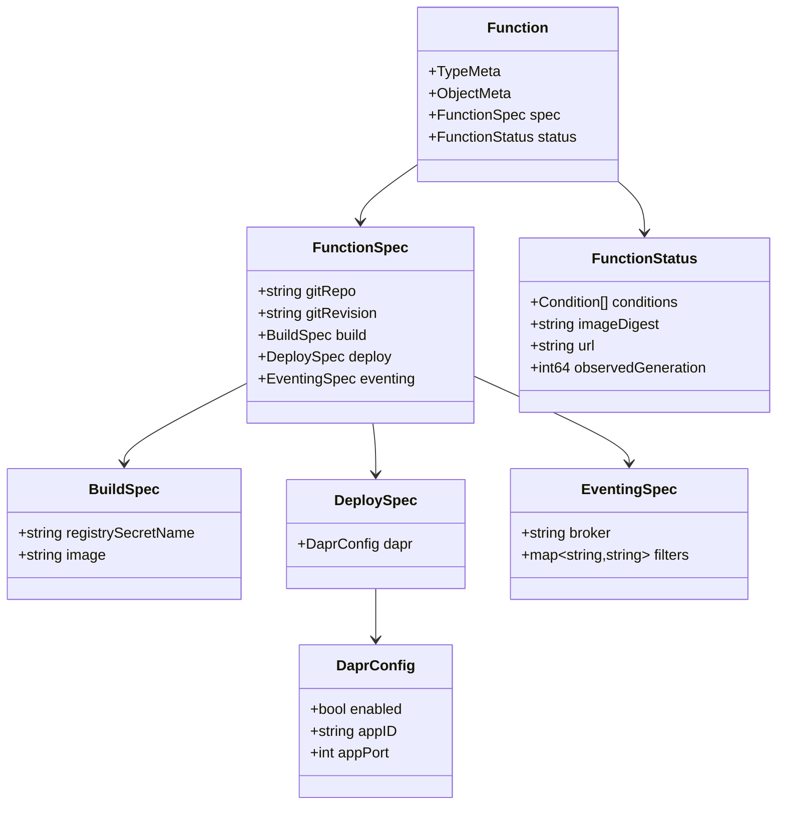

---

## 3. Operator Reconciliation Flow

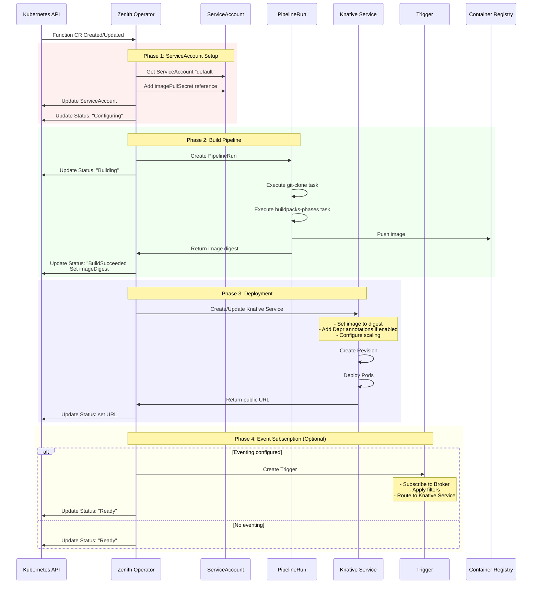

---

## 4. Complete Developer Experience Flow

```mermaid
graph TB
    subgraph "Step 1: Environment Setup"
        A1[Install Kubernetes Cluster<br/>kind/minikube/GKE/EKS]
        A2[Install Tekton Pipelines<br/>kubectl apply -f tekton.yaml]
        A3[Install Knative Serving<br/>kubectl apply -f knative-serving.yaml]
        A4[Install Knative Eventing<br/>optional]
        A5[Install Envoy Gateway<br/>for Gateway API]
        A6[Install Dapr<br/>optional]
        
        A1 --> A2
        A2 --> A3
        A3 --> A4
        A4 --> A5
        A5 --> A6
    end
    
    subgraph "Step 2: Install Zenith Operator"
        B1[Build Operator Image<br/>make docker-build IMG=...]
        B2[Push to Registry<br/>make docker-push IMG=...]
        B3[Install CRDs<br/>make install]
        B4[Deploy Operator<br/>make deploy IMG=...]
        B5[Verify Operator Running<br/>kubectl get pods -n zenith-operator-system]
        
        B1 --> B2
        B2 --> B3
        B3 --> B4
        B4 --> B5
    end
    
    subgraph "Step 3: Prepare Function Code"
        C1[Create Git Repository<br/>with function code]
        C2[Add Procfile or<br/>buildpack configuration]
        C3[Push to Git<br/>GitHub/GitLab/etc]
        
        C1 --> C2
        C2 --> C3
    end
    
    subgraph "Step 4: Configure Secrets"
        D1[Create Registry Secret<br/>kubectl create secret docker-registry]
        D2[Create Git Auth Secret<br/>optional, for private repos]
        
        D1 --> D2
    end
    
    subgraph "Step 5: Deploy Function"
        E1[Create Function YAML<br/>Define gitRepo, build, deploy, eventing]
        E2[Apply Function CR<br/>kubectl apply -f function.yaml]
        E3[Operator Reconciles<br/>Creates PipelineRun]
        E4[Build Executes<br/>git-clone + buildpacks]
        E5[Image Pushed<br/>to registry with digest]
        E6[Knative Service Created<br/>Deploys function pods]
        E7[Route Exposed<br/>Public URL available]
        E8[Trigger Created<br/>optional, for events]
        
        E1 --> E2
        E2 --> E3
        E3 --> E4
        E4 --> E5
        E5 --> E6
        E6 --> E7
        E7 --> E8
    end
    
    subgraph "Step 6: Function Ready"
        F1[Check Status<br/>kubectl get function]
        F2[View URL<br/>status.url field]
        F3[Test Function<br/>curl URL or send events]
        F4[Monitor Logs<br/>kubectl logs]
        F5[Auto-scaling Active<br/>scale-to-zero enabled]
        
        F1 --> F2
        F2 --> F3
        F3 --> F4
        F4 --> F5
    end
    
    A6 --> B1
    B5 --> C1
    C3 --> D1
    D2 --> E1
    E8 --> F1
    
    style A1 fill:#E3F2FD,stroke:#1976D2,stroke-width:2px
    style B1 fill:#E8F5E9,stroke:#388E3C,stroke-width:2px
    style C1 fill:#FFF3E0,stroke:#F57C00,stroke-width:2px
    style D1 fill:#FCE4EC,stroke:#C2185B,stroke-width:2px
    style E1 fill:#F3E5F5,stroke:#7B1FA2,stroke-width:2px
    style F1 fill:#E0F2F1,stroke:#00796B,stroke-width:2px
```

---

## 5. Key Features

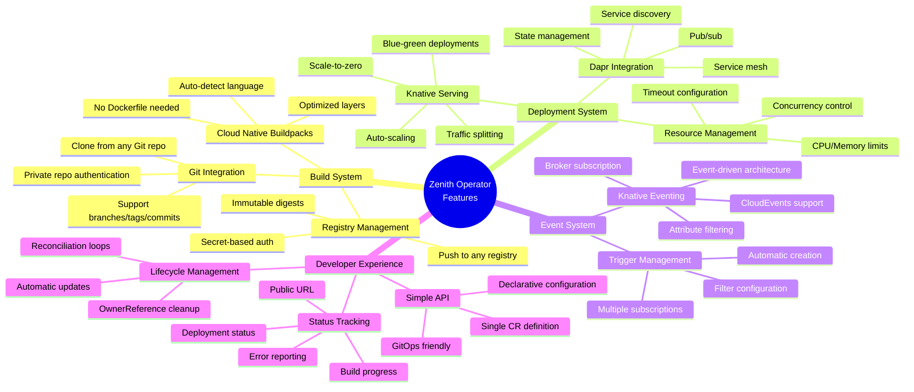

---

## 6. Tekton Build Pipeline Details

```mermaid
graph LR
    subgraph "PipelineRun Execution"
        START[PipelineRun Created]
        
        subgraph "Task 1: git-clone"
            T1_START[Start git-clone]
            T1_CLONE[Clone repository<br/>url: spec.gitRepo<br/>revision: spec.gitRevision]
            T1_OUTPUT[Write to workspace]
            T1_END[Complete]
            
            T1_START --> T1_CLONE
            T1_CLONE --> T1_OUTPUT
            T1_OUTPUT --> T1_END
        end
        
        subgraph "Task 2: buildpacks-phases"
            T2_START[Start buildpacks]
            T2_DETECT[Detect buildpacks<br/>analyze source code]
            T2_BUILD[Build image layers<br/>compile/package]
            T2_EXPORT[Export image]
            T2_PUSH[Push to registry<br/>spec.build.image]
            T2_DIGEST[Return digest<br/>APP_IMAGE_DIGEST]
            T2_END[Complete]
            
            T2_START --> T2_DETECT
            T2_DETECT --> T2_BUILD
            T2_BUILD --> T2_EXPORT
            T2_EXPORT --> T2_PUSH
            T2_PUSH --> T2_DIGEST
            T2_DIGEST --> T2_END
        end
        
        START --> T1_START
        T1_END -->|Shared Workspace| T2_START
        T2_END --> FINISH[PipelineRun Succeeded]
    end
    
    subgraph "Authentication"
        SA[ServiceAccount: default]
        SECRET[Secret: registrySecretName]
        
        SA -.->|imagePullSecrets| SECRET
        SA -.->|Used by| START
    end
    
    style START fill:#4CAF50,stroke:#2E7D32,stroke-width:2px,color:#fff
    style FINISH fill:#4CAF50,stroke:#2E7D32,stroke-width:2px,color:#fff
    style T1_CLONE fill:#2196F3,stroke:#1565C0,stroke-width:2px,color:#fff
    style T2_BUILD fill:#FF9800,stroke:#E65100,stroke-width:2px,color:#fff
    style T2_PUSH fill:#F44336,stroke:#C62828,stroke-width:2px,color:#fff
```

---

## 7. Knative Service Deployment Details

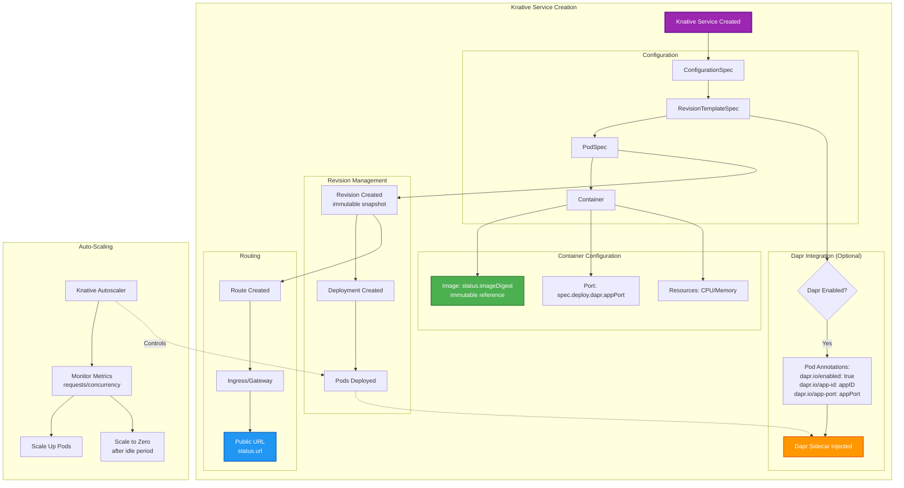

---

## 8. Event-Driven Architecture (Optional)

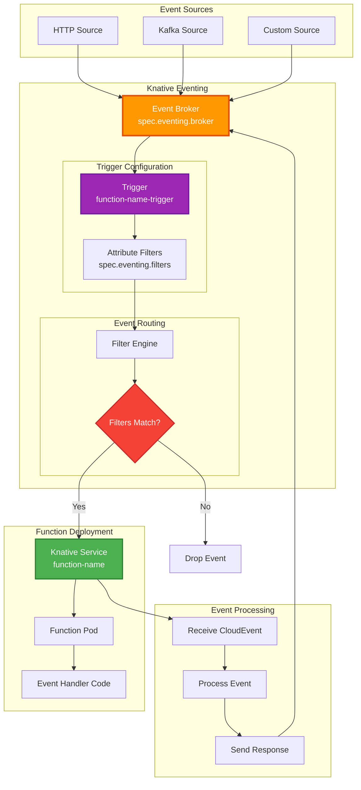

---

## 9. Status Conditions and Lifecycle

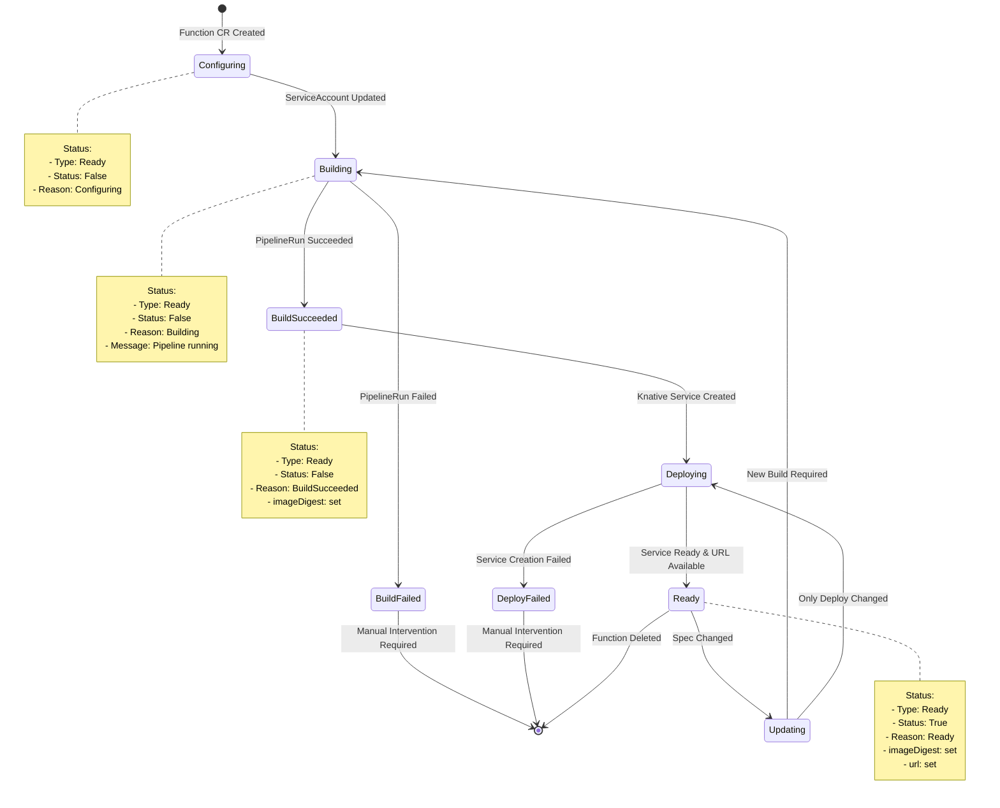

---

## 10. Example Function Definition

```yaml
apiVersion: functions.zenith.com/v1alpha1
kind: Function
metadata:
  name: hello-world
  namespace: default
spec:
  # Git repository containing function source code
  gitRepo: https://github.com/LucasGois1/zenith-test-functions
  gitRevision: main
  
  # Build configuration
  build:
    # Container registry secret for authentication
    registrySecretName: registry-credentials
    # Target image name (digest will be appended)
    image: docker.io/myorg/hello-world
  
  # Deployment configuration
  deploy:
    # Optional Dapr sidecar injection
    dapr:
      enabled: true
      appID: hello-world
      appPort: 8080
  
  # Optional event subscription
  eventing:
    # Knative Broker to subscribe to
    broker: default
    # CloudEvents attribute filters
    filters:
      type: com.example.greeting
      source: greeting-service

---
# After reconciliation, status will be:
status:
  conditions:
  - type: Ready
    status: "True"
    reason: Ready
    message: Deployed and ready to accept requests
  imageDigest: docker.io/myorg/hello-world@sha256:abc123...
  url: https://hello-world.default.example.com
  observedGeneration: 1
```

---

## 11. Operator Components and RBAC

```mermaid
graph TB
    subgraph "Operator Deployment"
        MANAGER[Controller Manager Pod<br/>zenith-operator-controller-manager]
        
        subgraph "Controllers"
            FUNC_CTRL[Function Controller<br/>FunctionReconciler]
            WATCH[Watch Resources]
            RECONCILE[Reconciliation Loop]
            
            FUNC_CTRL --> WATCH
            FUNC_CTRL --> RECONCILE
        end
        
        subgraph "Webhooks (Optional)"
            VALIDATING[Validating Webhook]
            MUTATING[Mutating Webhook]
        end
        
        MANAGER --> FUNC_CTRL
        MANAGER -.-> VALIDATING
        MANAGER -.-> MUTATING
    end
    
    subgraph "RBAC Permissions"
        SA_OP[ServiceAccount<br/>zenith-operator-controller-manager]
        ROLE[ClusterRole<br/>zenith-operator-manager-role]
        BINDING[ClusterRoleBinding]
        
        SA_OP --> BINDING
        ROLE --> BINDING
        
        subgraph "Permissions"
            PERM1[functions.zenith.com/*<br/>get, list, watch, create, update, patch, delete]
            PERM2[tekton.dev/pipelineruns<br/>get, list, watch, create, update, patch, delete]
            PERM3[serving.knative.dev/services<br/>get, list, watch, create, update, patch, delete]
            PERM4[eventing.knative.dev/triggers<br/>get, list, watch, create, update, patch, delete]
            PERM5[core/serviceaccounts<br/>get, list, watch, update, patch]
            PERM6[core/secrets<br/>get, list, watch]
        end
        
        ROLE --> PERM1
        ROLE --> PERM2
        ROLE --> PERM3
        ROLE --> PERM4
        ROLE --> PERM5
        ROLE --> PERM6
    end
    
    MANAGER --> SA_OP
    
    subgraph "Observability"
        METRICS[Metrics Server<br/>:8080/metrics]
        HEALTH[Health Probes<br/>:8081/healthz, /readyz]
        LOGS[Structured Logging]
        
        MANAGER --> METRICS
        MANAGER --> HEALTH
        MANAGER --> LOGS
    end
    
    style MANAGER fill:#4CAF50,stroke:#2E7D32,stroke-width:3px,color:#fff
    style FUNC_CTRL fill:#2196F3,stroke:#1565C0,stroke-width:2px,color:#fff
    style ROLE fill:#FF9800,stroke:#E65100,stroke-width:2px,color:#fff
```

---

## 12. Integration Points Summary

| Component | Purpose | Integration Method |
|-----------|---------|-------------------|
| **Tekton Pipelines** | Build container images from Git repos | Creates PipelineRun resources with git-clone and buildpacks tasks |
| **Knative Serving** | Deploy and scale functions | Creates Service resources with auto-scaling and routing |
| **Knative Eventing** | Event-driven invocations | Creates Trigger resources for broker subscriptions |
| **Dapr** | Service mesh capabilities | Injects sidecar via pod annotations |
| **Kong/Gateway API** | Ingress and routing | Used by Knative for external access |
| **Container Registry** | Store function images | Authenticated via Kubernetes secrets |
| **Git Repositories** | Source code storage | Cloned by Tekton git-clone task |

---

## 13. Key Design Principles

1. **Declarative API**: Single Function CR defines entire lifecycle
2. **GitOps Friendly**: All configuration in version control
3. **Immutable Deployments**: Uses image digests for reproducibility
4. **Owner References**: Automatic cleanup of child resources
5. **Status Conditions**: Standard Kubernetes condition reporting
6. **Reconciliation Loops**: Continuous state synchronization
7. **Extensibility**: Pluggable build and deployment systems
8. **Security**: Secret-based authentication, non-root containers
9. **Observability**: Metrics, health checks, structured logging
10. **Developer Experience**: Simple API, automatic builds, auto-scaling

---

## 14. Troubleshooting Flow

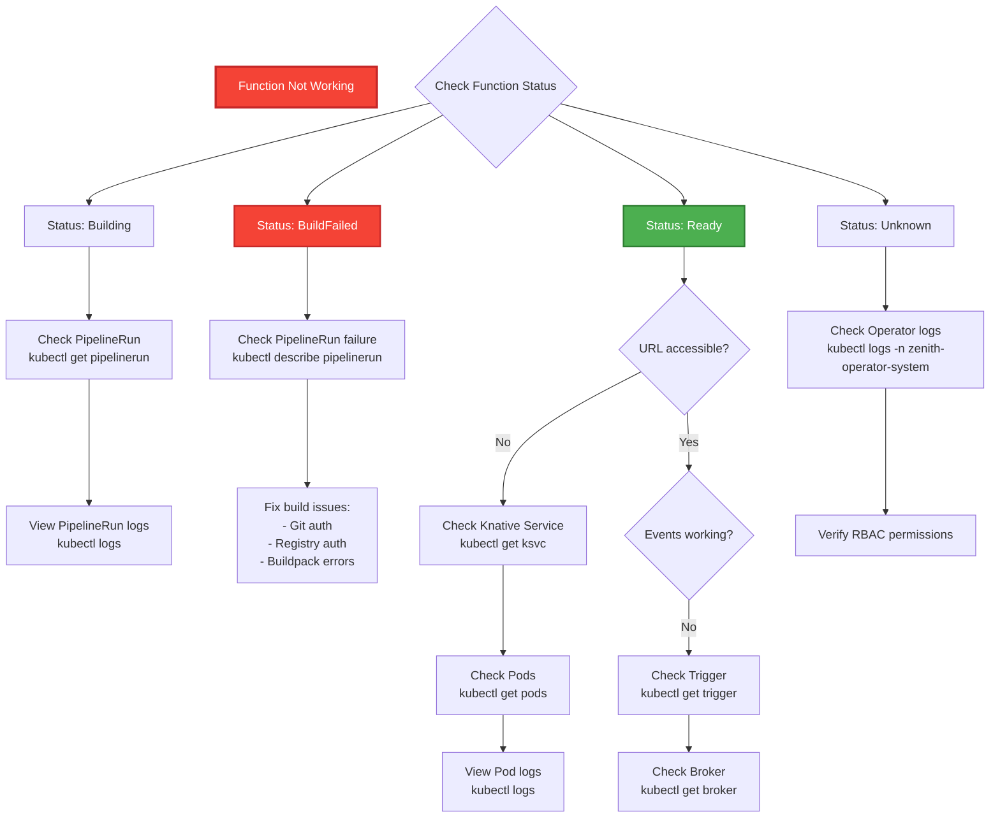

---

## Summary

The Zenith Operator provides a complete serverless function platform on Kubernetes by:

1. **Abstracting Complexity**: Single Function CR instead of managing multiple resources
2. **Automating Builds**: Tekton pipelines with Cloud Native Buildpacks
3. **Enabling Scale**: Knative Serving with auto-scaling and scale-to-zero
4. **Supporting Events**: Knative Eventing for event-driven architectures
5. **Integrating Service Mesh**: Optional Dapr sidecar injection
6. **Ensuring Security**: Secret-based authentication and RBAC
7. **Providing Observability**: Status conditions, metrics, and logs
8. **Simplifying Operations**: Automatic reconciliation and lifecycle management

The operator follows Kubernetes best practices and provides a production-ready platform for deploying and managing serverless functions at scale.
